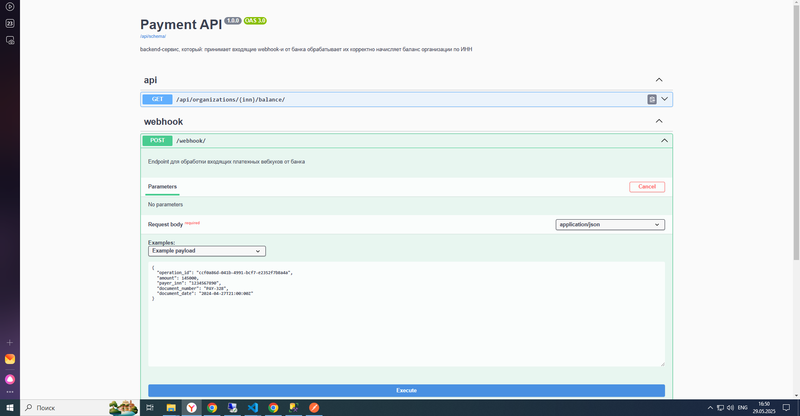
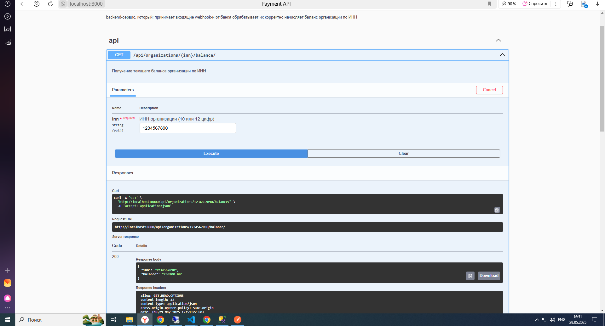

#  Тестовое задание для Backend Django Developer


## Getting Started <a name = "getting_started"></a>


```
git clone 
```

### Installing


```
cd payment_task
python -m venv venv
.\venv\Scripts\activate or  .\venv\bin\activate
pip install requirements.txt
cd config
```

And repeat

```
python manage.py makemigrations
python manage.py migrate
python manage.py runserver
```



